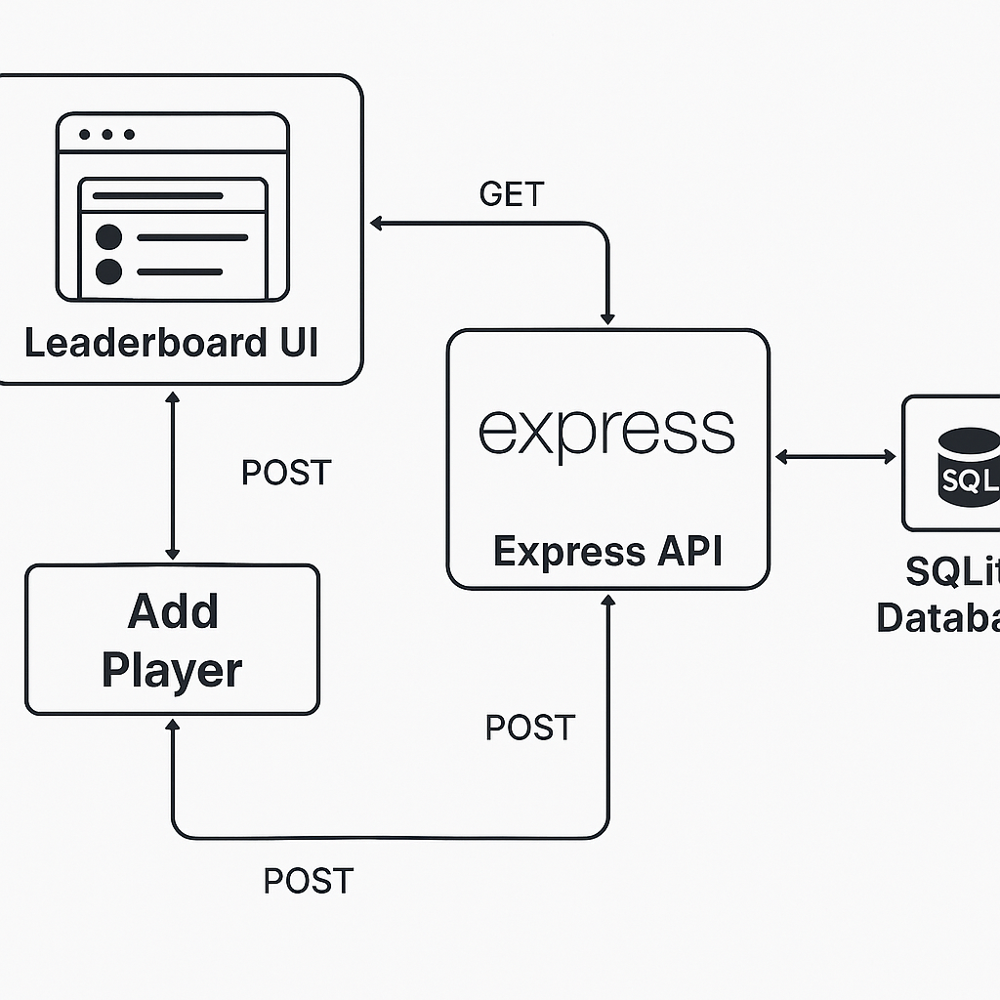

# 🏀 Full Stack AI NBA Roadmap

This repo documents my journey to becoming a full stack engineer with AI capabilities — using NBA data, strategy, and game analysis as my creative and technical foundation.

---

## 🙋‍♂️ Why I'm Doing This

I'm doing this to level up my engineering skills, unlock job opportunities in software and AI, and build a career with resilience, creativity, and autonomy. I want to create projects that both **inspire** and **improve** the way people learn, interact with data, and see the game of basketball.

---

## 🧠 What I’m Building

A full-stack web + mobile application that allows users to:

- 🎥 Upload an NBA play video
- 🧠 Use AI (object detection + clustering) to analyze it
- 🗺️ View a visual breakdown as a coach-style diagram
- 📊 Explore player stats, play tendencies, and insights
- 🗣️ Learn why plays worked (or didn’t) — and what could’ve been done differently

It’s part **sports analytics**, part **AI experiment**, and part **personal development platform** for fans, coaches, and learners.

---

## 🏗️ Project Structure

<pre>
nba-fullstack-roadmap/
├── /setup         # Terminal tools, CLI configs, Git aliases
├── /notes         # Daily reflections, research, progress logs
├── /fullstack
│   ├── backend    # Express + SQLite API (modularized)
│   ├── frontend   # Vanilla JS → React + Tailwind UI
├── /mobile        # React Native app (Expo + TypeScript)
├── /ai
│   ├── clustering         # KMeans, embeddings
│   ├── detection          # YOLO object detection models
│   ├── schemas            # Pydantic JSON schemas (input/output)
│   ├── examples           # Sample inputs/outputs
│   ├── notebooks          # ML dev notebooks
├── /portfolio     # Polished builds + case studies
├── PROGRESS.md    # Daily learning + shipping log
├── curriculum.md  # 70-day curriculum
└── README.md
</pre>

---

## 🔧 Tech Stack

- **Frontend:** HTML → React (Vite), TailwindCSS
- **Backend:** Node.js, Express, SQLite → PostgreSQL (planned)
- **Mobile:** React Native (Expo) + TypeScript
- **AI/ML:** Python (YOLOv8, FastAPI, clustering, OpenCV)
- **Tooling:** ESLint, Prettier, Jest, Notion, GitHub, iTerm2, Shell scripts
- **Cloud (Planned):** Fly.io or Render

---

## 🧠 AI + NBA = Endless Possibilities

- Automatically tag pick-and-rolls, isolations, or flare screens
- Learn defensive breakdowns and play counter-suggestions
- Cluster similar plays across seasons
- Build a personal assistant for NBA tape review

---

## 📈 My Goal

To use basketball as a lens for becoming a **production-grade full stack + AI engineer**, with a deep understanding of:

- Software architecture
- Clean code and tooling
- Machine learning deployment
- Data storytelling and product thinking

---

## 🗂️ Daily Progress

See [`PROGRESS.md`](./docs/PROGRESS.md) for day-by-day logs and reflections.

## 🗂️ Project Architecture

The following diagram shows how the frontend, backend, and database currently interact:

