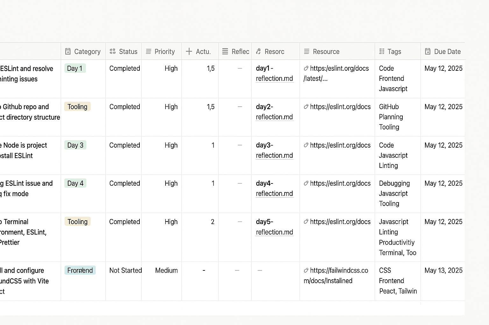

# 📅 Day 10 Reflection – NBA Full Stack + AI Roadmap

**Date:** May 14, 2025  
**Topic:** Form Handling, Input Validation, and Server Integration  
**Focus Area:** Frontend + Backend

---

## ✅ What I Accomplished

- Built a form in the frontend to allow users to submit new NBA players.
- Validated inputs for name (non-empty string) and points (non-negative integer).
- Sent `POST` requests to the backend server with the new data.
- Implemented error handling for failed submissions.
- Fetched and re-rendered the updated leaderboard after successful POST.
- Handled a major CORS issue and a tricky `req.body` bug due to a typo in `Content-Type`.
- Cleaned up Git tracking by adding `.gitignore` and removing `node_modules`.

---

## 🧠 What I Learned

- How `express.json()` works and why it needs to be before route declarations.
- How a typo in HTTP headers (`Content-Type`) can silently break backend parsing.
- The importance of step-by-step debugging and reading network responses.
- How to interpret 500 server errors and trace them to `req.body` issues.
- How to use Safari’s DevTools Network tab effectively.
- Git hygiene: why `node_modules` should never be tracked and how to untrack it.

---

## 🧩 What I Struggled With

- Subtle CORS misconfigurations.
- Frontend-backend miscommunication due to header typos.
- JavaScript alert blocks hanging the UI when debugging.
- Keeping Git commits clean while making iterative fixes.

---

## 🚀 Next Steps

- Prevent duplicate player submissions in the future.
- Add optimistic UI updates for smoother user feedback.
- Refactor validation logic into reusable helper functions.
- Consider abstracting fetch logic into a service layer.

---

## 📸 Visual Architecture

Here's a snapshot of the app structure as of Day 10:

---

**Reflection Link:**  
[notes/day10-reflection.md](../notes/day10-reflection.md)
